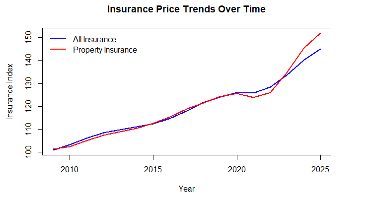
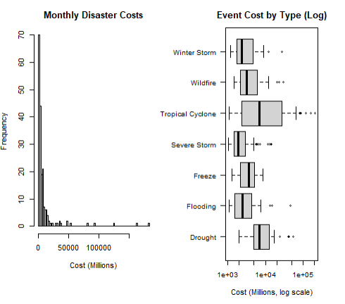
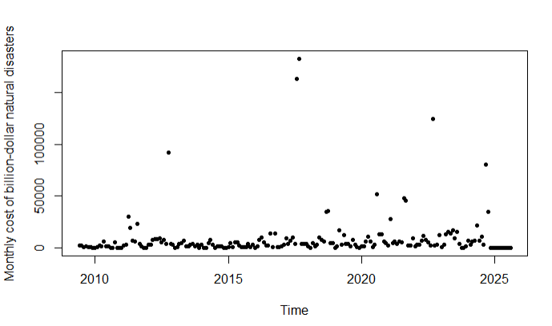
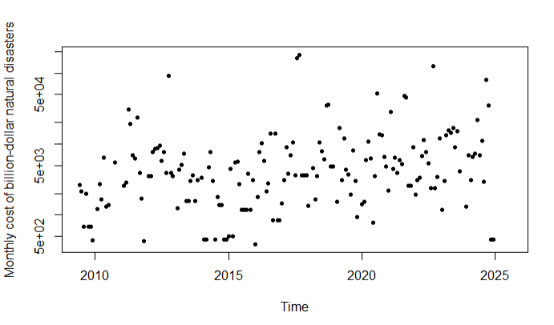
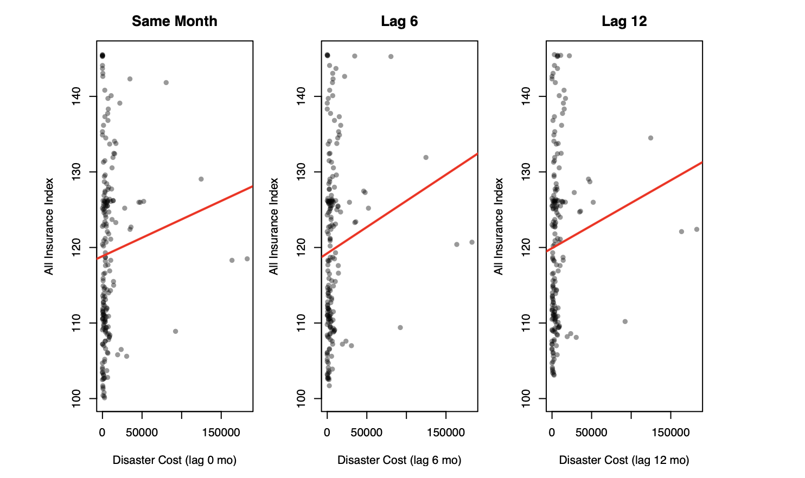

---
output:
  pdf_document: default
  html_document: default
---

# The Financial Correlations of Major Natural Disasters on Insurance Prices

Wesley He, Jasmine Patel, Jessica Xia

# Abstract:

Insurance is intended to be a protective measure against disasters or unforeseen events. However, large-scale natural disasters can mean insurance companies have to pay out huge sums to affected people, which may lead them to raise prices to recoup their costs. We analyze whether there is any relationship between large-scale natural disasters (with damage of 1 billion dollars or more) and insurance prices, specifically property insurance prices and overall insurance prices.

By combining datasets on natural disaster costs and insurance rate indices, we examined potential correlations between the financial impact of disasters and changes in insurance pricing. To standardize comparison, each disaster’s total cost was divided by its duration in months to calculate a “cost-per-month,” which was then applied across all datasets to ensure consistency.

Our analysis, however, indicates no strong linear correlation between the relative price of insurance and the relative cost of natural disasters, even after accounting for potential delayed effects. Severe storms remain the most frequent disaster type, and tropical cyclones still produce the highest overall costs, but these trends do not translate into proportional shifts in insurance prices. Instead, the data shows that both property insurance and overall insurance indices exhibit a strong linear upward trend over time, suggesting that insurance prices continue to rise regardless of the frequency or scale of major natural disasters.

# Introduction

Our analysis aims to determine whether large natural disasters affect insurance prices and whether certain types, like property insurance, are more strongly affected. The main question is whether higher disaster costs correspond to increases in overall insurance rates or in specific insurance rates. Our project examines the correlations between disaster expenses and insurance indices to determine potential market responses. It can offer valuable insight for policymakers, insurance companies, and consumers seeking to understand how natural disasters shape financial risk and insurance affordability.

# Data

We searched online for data relating to insurance prices and the costs of natural disasters. We ended up sourcing our data on insurance prices from the Bureau of Labor Statistics, which tracks the relative price index for insurance as a whole and for property insurance; both were adjusted for inflation. Unfortunately, no other information is provided, and only the relative cost to itself is given. Their downloadable dataset covers the period from 2009 to 2024.

The data on natural disasters came from the National Oceanic and Atmospheric Administration, which has a publicly available dataset of billion-dollar natural disasters (adjusted for inflation) dating back to 1980. Each one included the event, the event type, the disaster start date, the disaster end date, as well as inflation-adjusted and non-inflation-adjusted costs. It also had the number of deaths for that disaster. The natural disasters were divided into 7 types: Winter Storms, Wildfires, Tropical Cyclones, Severe Storms, Freezes, Floods, and Droughts.

# Data Cleaning:

Neither data set had any missing values, so cleaning it was just a matter of removing sone headers in the csv files that were describing how the data was formatted. The insurance data set contained data points for the relative cost of insurance each month for a total of 195 observations, and the natural disaster data contained 403 observations.

We assigned a cost to each month by dividing each natural disasters' cost by the number of months it spanned, before adding that result to the relevant months. Doing this with each natural disaster in the data set, we were able to assign a "monthly cost" of natural disasters to each month in our insurance data set.

# Visualizations

We can see that insurance prices seem to rise steadily over time. As our data is already corrected for inflation, this means that the rate that insurance costs rises outpaces inflation. This implies that either insurance companies raise prices to make more money, or that the costs of natural disasters or other things covered by insurance also increases regularly, outpacing inflation and requiring insurance companies to increase rates over time.

This figure has two parts: the left side shows the frequency of a disaster related to it's cost and the right side shows each disaster type by its cost. The purpose of this figure is to help viewers understand which events might be expected to have the greatest impact on insurance pricing. The results of both suggest that most months have very low or moderate damage, while a few months show extremely high spikes caused by major storms. Because these spikes are so large, they visually dominate the plot. The severely right-skewed distribution shows that disaster severity varies widely from month to month. This visual explains why disaster costs may not correlate well with smooth, steadily rising insurance prices.

This graph shows the cost of large natural disasters for each month from 2009 to 2024, in millions. Overall, the cost seems relatively low, with a few large outliers. Most of it came from hurricanes, which are the most destructive and often don't span multiple months, so their cost is concentrated in a single month in our data. For example, the two highest points in 2017 come mainly from Hurricane Harvey (\$160 billion in damage) and Hurricane Maria (\$115 billion in damage), in August and September, respectively. The irregular timing of high-cost disasters makes it hard to detect any predictable pattern over time. This unpredictability reduces the likelihood that disaster costs move in tandem with insurance prices. However, because of the height of these two points, much of the data is hard to tell apart. As such, below is the same data, except on a log scale.

Some months had no large natural disasters during their time frame, and as such had 0 as their monthly cost data point. To generate this graph, we added 1 to each cost so they would be set to 0. However, this should not significantly affect the graph.

Using a log scale helps spread out the smaller and mid-sized disaster costs so they’re easier to compare, since the last figure's outliers were too extreme. Most disasters fall within a similar range once they are scaled, while only a few stand out as extremely expensive. There is still no clear positive trend across the recorded 15-year period. This suggests that while disasters vary in severity, their typical magnitude has not systematically increased. The lack of positive correlation in this graph contrasts with the smooth upward trend seen in insurance pricing.

All three scatter plots (0,6, 12 month delay) look similar to each other, with the red best fit line steepest for the 6 month delay. This means that if insurance prices increase due to large-scale natural disasters, it is most likely that it would be after 6 months. However, the correlation on these plots is all poor, as the vast majority of points hover on the left side and seem randomly distributed up and down, while there are very few outlier points on the right which seem to be the cause of the best fit line

# Analysis

First, we are interested in whether our two notable variables—insurance prices and damages caused by natural disasters—increase over time. To do so, we conducted a linear regression with time (the given month/year) as the explanatory variable and the total damages from natural disasters and relative property insurance prices as the predictor variables.

| Predictor Variable | Explanatory Variable | Coefficient | P-value | R-sq |
|---------------|---------------|---------------|---------------|---------------|
| Monthly Natural Disaster Damage | Time | 0.0000376 | 0.756 | 0.011 |
| Relative Property Insurance Price | Time | 0.00737 | 2e-16 | 0.907 |

These results indicate that the price of property insurance is linearly correlated with time. Specifically, every month, the price of property insurance is predicted to increase by about 0.74% relative to its level in January 2009, or about 8.9% per year. Unfortunately, since our data only contains relative prices, we don't know the exact amount. However, an R-squared value of 0.907 implies that about 91% of the variation in property insurance prices is explained by our linear model using time.

With a p-value of 0.756, we can be confident that the scale of damage from large natural disasters has not increased with time. Given that insurance prices rise over time, it is doubtful that insurance prices and natural disaster damage are linearly correlated, but we will run the tests nonetheless.

| Predictor Variable | Explanatory Variable | Coefficient | P-value |
|------------------|------------------|------------------|------------------|
| Relative Property Insurance Price | Monthly Natural Disaster Damage | 0.0000431 | 0.245 |
| Relative Property Insurance Price | Log of Monthly Natural Disaster Damage | -0.480 | 0.148 |

Across both regression models, the p-values were above 0.05, indicating no statistically significant linear relationship between natural disaster costs and insurance prices within the same month. However, this could be because the insurance prices may take time to respond to disasters. To confirm this hypothesis, we examine whether stronger associations emerge when introducing 0-month, 6-month, and 12-month lags between disaster costs and insurance price changes.

To test whether there was simply a delay in raising insurance prices when natural disasters caused damage, we took the relative price of insurance after the set delay. We divided it by the relative price of insurance during the period when the damage was caused. For example, if Jan. 2012's relative insurance price was 110, and Jan. 2013's relative insurance price was 121, then the relative price would be 121/110 = 1.1 for Jan 2012.

| Predictor Variable | Explanatory Variable | Coefficient | P-value |
|------------------|------------------|------------------|------------------|
| Relative Property Insurance Price After 1 Month | Natural Disaster Damage | -7.656e-9 | 0.507 |
| Relative Property Insurance Price After 6 Months | Natural Disaster Damage | 4.478e-9 | 0.912 |
| Relative Property Insurance Price After 12 Months | Natural Disaster Damage | 3.401e-8 | 0.669 |

The minuscule coefficients, high p-values, and R-squared values so low that they weren't worth including indicate that there is no relation at all between property insurance prices and the scale/cost of natural disasters, even when accounting for a 1-12 month delay in insurance prices rising.

Overall, the weak linear trends observed at all lag lengths help explain why the regression p-values were not statistically significant. Even if there is a slight delayed effect of natural disasters on insurance pricing, the data does not show a strong nor consistent linear relationship.

We also ran similar tests comparing overall insurance prices to property insurance prices, but the results were nearly identical, with no correlation observed.

# Conclusion

Overall, we were unable to find any linear correlation between the cost/destruction of large natural disasters and the price of property insurance in the US. This does make sense in a way, as insurance companies likely already take these risks into account when calculating insurance prices, and don't have to hike prices as they expect some natural disasters to occur.

Additionally, we were unable to find a linear correlation between the destruction caused by natural disasters and time, implying that, thankfully, the damage caused by large-scale natural disasters has not been increasing.

However, we found a very strong linear correlation between insurance price and time. This implication, along with the very small p-value and high R-squared, suggests that insurance companies regularly hike the price of property insurance, even as the damage from large-scale natural disasters remains unchanged.
